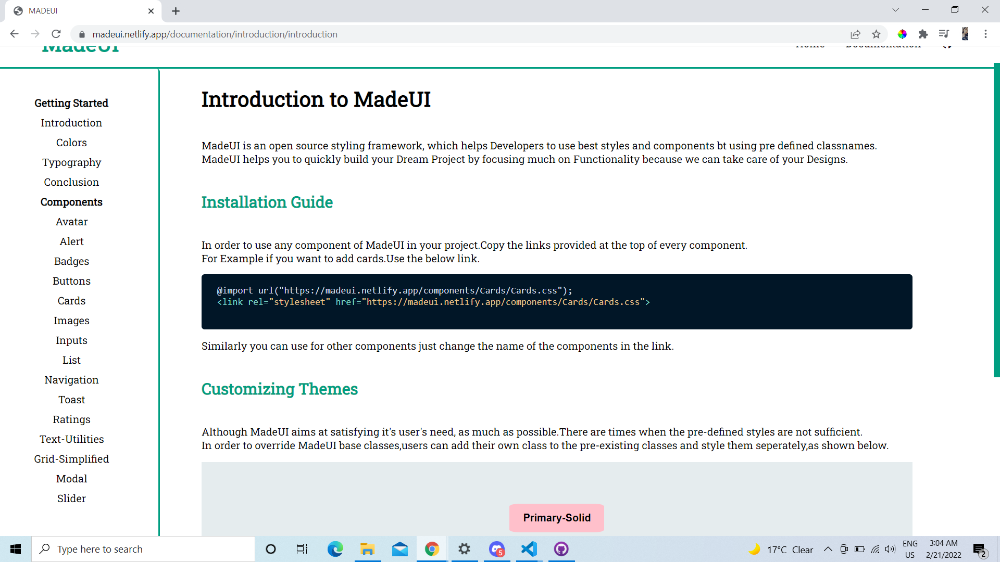

#  🔗[MADEUI](https://madeui.netlify.app/)

MADEUI is a CSS Component Library focused on developing resuable components.
## Installation

Every Component will have seprate Installtion link.For example If you want to use Card component of MADEUI you can copy the link provided on top on each component file.
Example For using button you can use the link (https://madeui.netlify.app/components/cards/cards)

## Components:

### [Avatar](https://madeui.netlify.app/components/avatars/avatar)
An avatar is a graphical representation of a user or the user's character or persona.

+  Standard Avatar
+  Status Avatar
+  Square Shaped Avatar 

### [Alerts](https://madeui.netlify.app/components/alerts/alerts)
Alerts help us in grabbing user's attention to show feedback about an action or state.

+  Simple Alerts
+  Outline Alerts
+  Close Button Alerts

### [Badges](https://madeui.netlify.app/components/badges/badges)
A Badge is used to represent a user's profile or the updates/messages that the user received

+  Status Badge
+  Icon Badge
+  Text Badge

### [Buttons](https://madeui.netlify.app/components/buttons/buttons)
A Button is a simple element that helps in performing an action/redirection.

+  Primary Buttons
+  Secondary Buttons
+  Floating Action Buttons
+ Link Buttons
+ Icon Buttons

### [Cards](https://madeui.netlify.app/components/cards/cards)
Cards are used to display a product and their respective info.

+  Vertical Cards
+  Horizontal Cards
+  Shadow Cards
+ Badege Cards
+ Text-Overlay Cards
+ Text Only Cards
+ Dismiss Cards

### [Images](https://madeui.netlify.app/components/images/images)
Images can be made responsive, so that they can adjust to the parent's width and never overflow. They can also be customsed to round shape.

+  Responsive Images
+  Round Images
+ Square Images

### [Inputs](https://madeui.netlify.app/components/inputs/inputs)
Form contain multiple things like Text Input, Password, Checkbox etc, we'll see them below along with their validation.

+  Normal Input Fields.
+  Input Fields with Validation.
+ Input Fields with Errors.

### [List](https://madeui.netlify.app/components/list/list)
Lists help us in grouping similar items together in a series.

+  Ordered List
+  Unordered List
+ Notification List.

### [Navigation](https://madeui.netlify.app/components/navigation/navigation)
A Navbar is used to switch between different pages in a website/web-app.
+  Simple Navigation
+  Navigation with Icons
+  Navigation with Menu Button for Mobiles

### [Toast](https://madeui.netlify.app/components/toast/toast)
Toasts help us in providing feedback about a recent user action.
+  Simple Toast
+  Colorful Toast

### [Ratings](https://madeui.netlify.app/components/rating/rating)
Ratings help the user to provide a product review and also help in making a buying decision based on average product ratings.

+  Star Ratings
+  Badge Ratings

### [Text-Utilities](https://madeui.netlify.app/components/text-utlities/text-utilities)
Text Utilities are used to style an element that hold some text, easily.

+  Heading Text
+  Text with different Alignment
+ Different text size
+ Text transform
+ Font-Weights

### [Grid Simplified](https://madeui.netlify.app/components/gridsimplified/gridsimplified)
Grids help us in divding the page into different sections easily.

+  50-50 Grid Layout
+  70-30 Frid Layout
+ 30-70 Frid Layout
+ Three Columns Grid
+ Four Columns Grid

### [Modal](https://madeui.netlify.app/components/modal/modal)
Modal helps us to take some action from the user to proceed further.
+  Modal

###  [Slider](https://madeui.netlify.app/components/slider/slider)
Sliders are used to decide range for things like volume, price etc.
+ Simple Slider
+ Slider with Icon
+ Designed Slider

### PREVIEW

### Tech Stack
+ HTML
+ CSS
+ JS

