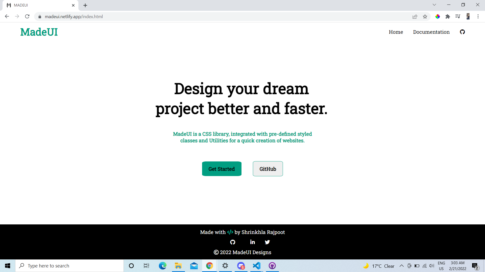
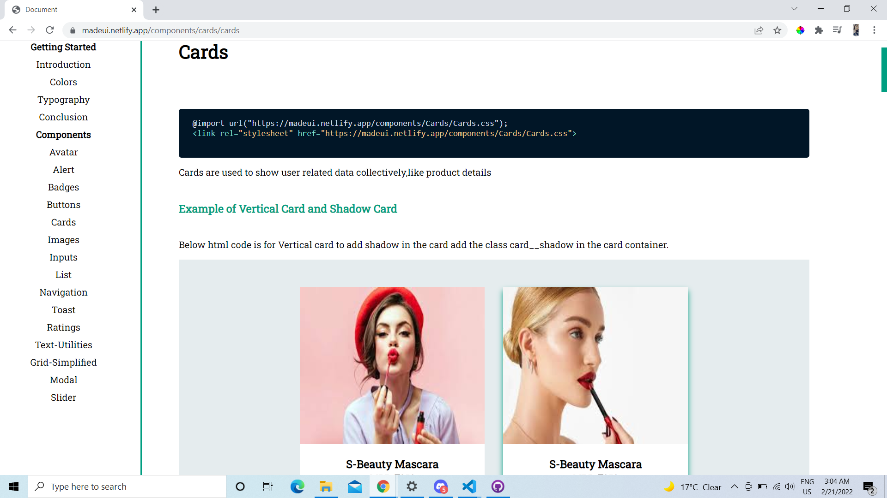

#  🔗[MADE-UI](https://madeui.netlify.app/)


A Component Library to get all the basic ready-made Components.

# Installation

To start using Made-UI copy the link with a component Path to include the particular component in your project.For Example to include Cards component use the link
```
 @import url("https://madeui.netlify.app/components/Cards/Cards.css");
<link rel="stylesheet" href="https://madeui.netlify.app/components/Cards/Cards.css">
```
For other components change the Components name in above Link.

# How To use
* To start using the components open the [documentation](https://madeui.netlify.app/components/avatars/avatar) of the MADEUI and copy the link provided on the top of each page and Copy that code snippet in your html file.
* For the functionality copy and paste the javascript code given below of each compoenent in the documentation Page.
* To provide your own style you can add your own class to the pre-existing classes and style them seperately.

# Components
 ### [Avatars](https://madeui.netlify.app/components/avatars/avatar)
* Simple Avatars
* Avatars with Status
* Square shaped Avatars.

 ### [Alerts](https://madeui.netlify.app/components/alerts/alerts)
* Simple Alerts
* Outline Alerts
* Alerts with close buttons.

 ### [Badges](https://madeui.netlify.app/components/badges/badges)
* Status Badges
* Icons Badges
* Text Badges

 ### [Buttons](https://madeui.netlify.app/components/buttons/buttons)
* Primary Buttons
* Secondary Buttons
* Floating Buttons
* Links Buttons
* Buttons with Icons

 ### [Cards](https://madeui.netlify.app/components/cards/cards)
* Vertical Cards
* Shadow Cards
* Horizontal Cards
* Card with Badges
* Card with text-overlay
* Card with dismiss
* Text only Card

 ### [Images](https://madeui.netlify.app/components/images/images)
* Responsive Images
* Round Images
* Square shaped Images

 ### [Inputs](https://madeui.netlify.app/components/inputs/inputs)
* Normal Field Inputs
* Validation Input Field
* Error Input Field

 ### [Lists](https://madeui.netlify.app/components/list/list)
* Unordered list with bullets
* Ordered List with bullets
* Notification List

 ### [Navigation](https://madeui.netlify.app/components/navigation/navigation)
* Simple Navigation Bar
* Navigation Bar with Icons
* Navigation Bar with Humburger

 ### [Toast](https://madeui.netlify.app/components/toast/toast)
* Simple Toast
* Colorful Toast

 ### [Ratings](https://madeui.netlify.app/components/rating/rating)
* Star Ratings
* Badge Ratings

 ### [Text-Utilities](https://madeui.netlify.app/components/text-utlities/text-utilities)
* Heading Text
* Text-Alignments
* Different sizes text
* Text-transform
* Font-weights

 ### [Grid-Simplified](https://madeui.netlify.app/components/gridsimplified/gridsimplified)
* 50-50 Layout
* 70-30 Layout
* 30-70 Layout
* Three column grid
* Two column grid

 ### [Modal](https://madeui.netlify.app/components/modal/modal)
* Simple Modal

 ### [Slider](https://madeui.netlify.app/components/slider/slider)
* Simple Slider
* Slider with Icon
* Designed Slider




